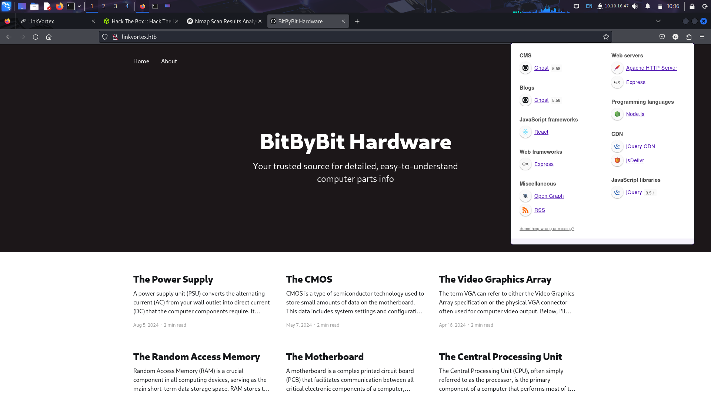
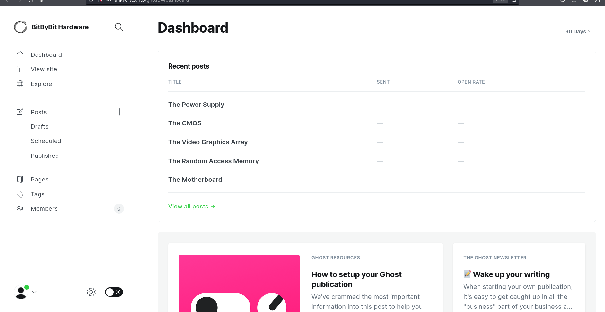

[LinkVortex — Writeup HTB](https://medium.com/@anandhusuresh990/linkvortex-writeup-htb-5082f90b9507)

initial sate


nmap





there exist the CVE for ghost 5.58


there is url for sitemap 


there wasn’t anything, just the content that was in the home page

/ghost endpoint is allowed but other are not 


since I don’t have any credentials I will keep this up to here

for this domain there is nothing to be found 

lets check for the subdomain enumeration 


found subdomain “dev”


landing page for dev

this subdomain seems to be for developer 

now what’s next?

directory search 

since this website looks like developers 

i tried /.git endpoint it worked 
This happened second time for me, I faced same situation while I was doing dog machine 


What’s next 

use git-dumper to download git repo to our local machine 


now I have complete version of the ghost


usernamer root and email 

dev@linkvortex.htb


I tired the email that I found on the website dev@linkvortex.htb
its not working 


I was just checking whether admin exist or not 

it really did

OctopiFociPilfer45

now whats next ?
try the random password that I found on code ?




admin dashboard

current version of ghost is 5.58.0


there is nothing to be found 
we found out that the ghost version is vulnerable 

[https://github.com/0xDTC/Ghost-5.58-Arbitrary-File-Read-CVE-2023-40028](https://github.com/0xDTC/Ghost-5.58-Arbitrary-File-Read-CVE-2023-40028)

### **How this CVE-2023-40028 works?**


- When symlink is uploaded and processed by the Ghost, it can point to any file within server’s filesystem.
    
    
    
- this flaws allows attacker to access sensitive file

**Requirement for this Exploits**

- must be authenticated and have access to the Ghost CMS

OctopiFociPilfer45 admin@linkvortex.htb http://linkvortex.htb/ghost


what could be more informative file like /etc/passwd/? I search for other sensitive file to read but didn’t get more informative than the /var/lib/ghost/config/.production.json file.


The above file seems to be the more sensitive to compared to other file for now. As there could be configuration which includes

```bash
Enter the file path to read (or type 'exit' to quit): /var/lib/ghost/config.production.json

File content:
{
  "url": "http://localhost:2368",
  "server": {
    "port": 2368,
    "host": "::"
  },
  "mail": {
    "transport": "Direct"
  },
  "logging": {
    "transports": ["stdout"]
  },
  "process": "systemd",
  "paths": {
    "contentPath": "/var/lib/ghost/content"
  },
  "spam": {
    "user_login": {
        "minWait": 1,
        "maxWait": 604800000,
        "freeRetries": 5000
    }
  },
  "mail": {
     "transport": "SMTP",
     "options": {
      "service": "Google",
      "host": "linkvortex.htb",
      "port": 587,
      "auth": {
        "user": "bob@linkvortex.htb",
        "pass": "fibber-talented-worth"
        }
      }
    }
}
```


this script moves symlink to quarantine folder, if it points to critical file system.


possible exploit 

```bash
ln -s /etc/passwd myfile.png
```

now myfile.png is shortcut to /etc/passwd  with this example we can point to /root/root.txt

I tried lot of times and got stuck, when I saw the walkthrough, they were pointing to a file and that file  is pointing to root.txt. they were creating two file to point to the root.txt


### Learning

This machine was bit easy and simple. The takeaway from this room is the concept of creating short cut to system file to get sensitive information. Which can lead to system compromise. This vulnerability seems look simple but it is too dangerous as we can read the system file with the help of this vulnerability.

### Reference

[Owned LinkVortex from Hack The Box!](https://www.hackthebox.com/achievement/machine/1873334/638)