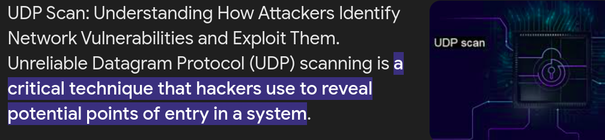

### Scan Techniques

Nmap offers a variety of scan techniques, including:

1. **TCP SYN Scan (`sS`)**:
    - Sends a single SYN packet to initiate a TCP handshake.
    - If the target responds with:
        - **SYN-ACK**: The port is open.
        - **RST**: The port is closed.
        - **No response**: The port is filtered (firewall or IDS may block it).
2. **UDP Scan (`sU`)**: Scans UDP ports.



1. **TCP Null, FIN, and Xmas Scans (`sN`, `sF`, `sX`)**: Bypass firewalls by sending unconventional packets.


1. **Idle Scan (`sI`)**: Uses a third-party host to mask the scan origin.


1. **IP Protocol Scan (`sO`)**: Identifies supported IP protocols.
2. **FTP Bounce Scan (`b`)**: Scans through an FTP server.

### Example: TCP SYN Scan (`sS`)

Here’s an example of a basic TCP SYN scan:

```bash
sudo nmap -sS localhost
```

**Output:**

```kotlin
Starting Nmap 7.80 ( https://nmap.org ) at 2020-06-11 22:50 UTC
Nmap scan report for localhost (127.0.0.1)
Host is up (0.000010s latency).
Not shown: 996 closed ports
PORT     STATE SERVICE
22/tcp   open  ssh
80/tcp   open  http
5432/tcp open  postgresql
5901/tcp open  vnc-1
```

### Explanation:

- **Port**: The port number (e.g., `22`, `80`).
- **State**: Whether the port is `open`, `closed`, or `filtered`.
- **Service**: The type of service running on the port (e.g., `ssh`, `http`).

### Key Benefits of Nmap

- **Flexibility**: Multiple scanning techniques.
- **Efficiency**: Scans thousands of ports quickly.
- **Insightful Results**: Provides detailed information about the target.
- **Customizable**: Use scripts and options for specific tasks.

Nmap is a tool for understanding and securing networks effectively.
