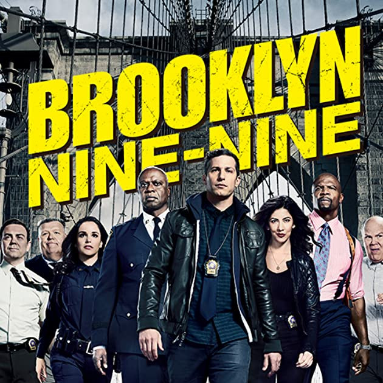

DIfficulty: Easy



### Nmap

```python
┌──(khem㉿kali)-[~]
└─$ nmap -F -sV -sC 10.10.10.235
Starting Nmap 7.94SVN ( https://nmap.org ) at 2024-11-24 10:09 EST
Nmap scan report for 10.10.10.235
Host is up (0.36s latency).
Not shown: 97 closed tcp ports (conn-refused)
PORT   STATE SERVICE VERSION
21/tcp open  ftp     vsftpd 3.0.3
| ftp-anon: Anonymous FTP login allowed (FTP code 230)
|_-rw-r--r--    1 0        0             119 May 17  2020 note_to_jake.txt
| ftp-syst: 
|   STAT: 
| FTP server status:
|      Connected to ::ffff:10.17.7.239
|      Logged in as ftp
|      TYPE: ASCII
|      No session bandwidth limit
|      Session timeout in seconds is 300
|      Control connection is plain text
|      Data connections will be plain text
|      At session startup, client count was 1
|      vsFTPd 3.0.3 - secure, fast, stable
|_End of status
22/tcp open  ssh     OpenSSH 7.6p1 Ubuntu 4ubuntu0.3 (Ubuntu Linux; protocol 2.0)
| ssh-hostkey: 
|   2048 16:7f:2f:fe:0f:ba:98:77:7d:6d:3e:b6:25:72:c6:a3 (RSA)
|   256 2e:3b:61:59:4b:c4:29:b5:e8:58:39:6f:6f:e9:9b:ee (ECDSA)
|_  256 ab:16:2e:79:20:3c:9b:0a:01:9c:8c:44:26:01:58:04 (ED25519)
80/tcp open  http    Apache httpd 2.4.29 ((Ubuntu))
|_http-title: Site doesn't have a title (text/html).
|_http-server-header: Apache/2.4.29 (Ubuntu)
Service Info: OSs: Unix, Linux; CPE: cpe:/o:linux:linux_kernel

Service detection performed. Please report any incorrect results at https://nmap.org/submit/ .
Nmap done: 1 IP address (1 host up) scanned in 26.91 seconds
```

Found 3 ports open first lets see ftp port 21


I was able to login as anonymous user and got note for user Jack from Amy.

Investigating Web page


After knowing this, I guess we need to deal with this type of content.

we only have this big picture. lets check it out.


I downloaded the image and tried to extract the hidden content, but this happended


need passphrase, need to think about it


found a way to find the passphrase, its admin


ohh it has username and its password as well. remember we found ssh port 22 open earlier.


logged into user holt


I found the same user here. that is Jack


I think we need to login as jack to get more information, so I brute force the password for jake


yeah!!! got it!


it means that jake can execute the “less” binary with sudo privileges. lets check it out 


### Final Thought

One of the best beginner level which teaches just one concept. Wanna recommend to beginner friend.
