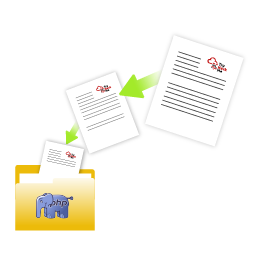

Dfficulty: Easy



**Nmap Scan**

```python
PORT     STATE    SERVICE     REASON      VERSION
22/tcp   open     ssh         syn-ack     OpenSSH 8.2p1 Ubuntu 4ubuntu0.5 (Ubuntu Linux; protocol 2.0)
80/tcp   open     http        syn-ack     Apache httpd 2.4.41 ((Ubuntu))
139/tcp  open     netbios-ssn syn-ack     Samba smbd 4.6.2
445/tcp  open     netbios-ssn syn-ack     Samba smbd 4.6.2
8654/tcp filtered unknown     no-response
Service Info: OS: Linux; CPE: cpe:/o:linux:linux_kernel
```

Found 4 ports open

lets check port 80, cause it provide more information compared to other port 


ohh got login page!!! lets keep this aside and search for hidden directories


there is nothing in the source code

since the web page provide more information to us and even the important document could be hidden. 

What I feel like is, when level increases we need more words for gubuster to find hidden directories

I am not able to upload the reverse shell file. But I can hide the file name extension. Lets do this.

```python
┌──(khem㉿kali)-[~]
└─$ gobuster dir -w /usr/share/wordlists/dirbuster/directory-list-1.0.txt -u http://10.10.158.47/
===============================================================
Gobuster v3.6
by OJ Reeves (@TheColonial) & Christian Mehlmauer (@firefart)
===============================================================
[+] Url:                     http://10.10.158.47/
[+] Method:                  GET
[+] Threads:                 10
[+] Wordlist:                /usr/share/wordlists/dirbuster/directory-list-1.0.txt
[+] Negative Status codes:   404
[+] User Agent:              gobuster/3.6
[+] Timeout:                 10s
===============================================================
Starting gobuster in directory enumeration mode
===============================================================
/css                  (Status: 301) [Size: 310] [--> http://10.10.158.47/css/]
/cloud                (Status: 301) [Size: 312] [--> http://10.10.158.47/cloud/]
```


since there is image upload source, we can hide the reverse shell.


as we can see here .php extension is not allowed 


finally after trying for many times reverse shell is successful


there  is a user sysadmin under home directory 


permission denied!! we need higher privilege to see this file. I haven’t sneak much, have to find all the possible way to get higher privilege.

After searching for many things, I saw one directory which could give some hints 


I even downloaded file

```python
┌──(khem㉿kali)-[~]
└─$ wget http://10.10.97.110:8080/dataset.kdbx

--2024-11-19 20:52:52--  http://10.10.97.110:8080/dataset.kdbx
Connecting to 10.10.97.110:8080... connected.
HTTP request sent, awaiting response... 200 OK
Length: 1566 (1.5K) [application/octet-stream]
Saving to: ‘dataset.kdbx’

dataset.kdbx    100%[=====>]   1.53K  --.-KB/s    in 0s      

2024-11-19 20:52:54 (160 MB/s) - ‘dataset.kdbx’ saved [1566/1566]
```


need password to open 


```python
┌──(khem㉿kali)-[~]
└─$ john --wordlist=rockyou.txt dbhash 
Created directory: /home/khem/.john
Using default input encoding: UTF-8
Loaded 1 password hash (KeePass [SHA256 AES 32/64])
Cost 1 (iteration count) is 100000 for all loaded hashes
Cost 2 (version) is 2 for all loaded hashes
Cost 3 (algorithm [0=AES 1=TwoFish 2=ChaCha]) is 0 for all loaded hashes
Press 'q' or Ctrl-C to abort, almost any other key for status
741852963        (dataset)     
1g 0:00:00:29 DONE (2024-11-19 22:12) 0.03355g/s 29.16p/s 29.16c/s 29.16C/s 741852963
Use the "--show" option to display all of the cracked passwords reliably
Session completed. 
```

got the password to open the file.


Cl0udP4ss40p4city#8700

this password is for user sysadmin which was found earlier. 


got into the port 22 as sysadmin. 

When I am lost I always prefer linpeas, since it scan all target thoroughly. 

[https://github.com/peass-ng/PEASS-ng/tree/master/linPEAS](https://github.com/peass-ng/PEASS-ng/tree/master/linPEAS)

I have left a reference here


When I ran the [linpeas.sh](http://linpeas.sh) it is


```php
<?php

//Backup of scripts sysadmin folder
require_once('lib/backup.inc.php');
zipData('/home/sysadmin/scripts', '/var/backups/backup.zip');
echo 'Successful', PHP_EOL;

//Files scheduled removal
$dir = "/var/www/html/cloud/images";
if(file_exists($dir)){
    $di = new RecursiveDirectoryIterator($dir, FilesystemIterator::SKIP_DOTS);
    $ri = new RecursiveIteratorIterator($di, RecursiveIteratorIterator::CHILD_FIRST);
    foreach ( $ri as $file ) {
        $file->isDir() ?  rmdir($file) : unlink($file);
    }
}
?>
```

what this code does

- back up the /home/sysadmin/scripts folder into zip archive located at /var/backups/backup.zip
- deletes all the files and subdirectories in /var/www/html/cloud/images if the directory exists0

 


### Final Thought

Same as all the room🔥! I learned new ways to escalate privilege.
