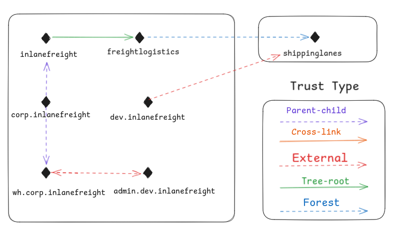

In Active Directory(AD), there are five FSMO roles (Flexible Single Master Operations). Each role handles a specific task to keep the domain and the forest working.

| **FSMO Role** | **Description** |
| --- | --- |
| **Schema Master** | Manages the **read/write copy** of the AD **schema**. Defines all **attributes** that can apply to AD objects. |
| **Domain Naming Master** | Manages **domain names** in the forest. Ensures **no duplicate domain names** exist in the same forest. |
| **RID Master** | Assigns **blocks of Relative IDs (RIDs)** to other Domain Controllers. Ensures each object has a **unique SID**. |
| **PDC Emulator** | Acts as the **authoritative DC**. Handles **authentication requests**, **password changes**, and **Group Policy** management. Maintains **time sync**. |
| **Infrastructure Master** | Translates **GUIDs**, **SIDs**, and **Distinguished Names (DNs)** between domains. Used in **multi-domain forests**. Helps avoid SID display issues. |

FSMO roles can be assigned to **specific Domain Controllers (DCs)**. Problems with FSMO roles cause login and access issues in the domain.

### Domain and Forest Functional Levels

Domain and Forest Functional Levels control the features and capabilities in Active Directory. They also decide which Windows Server versions can run as a Domain Controller.  Functional levels start from Windows 2000 native up to Windows Server 2016. Each new level adds more features on top of the previous one.

| Domain Functional Level | Key Features | Supported Domain Controllers |
| --- | --- | --- |
| **Windows 2000 native** | Universal groups, group nesting, group conversion, SID history | Windows 2000, 2003, 2008, 2008 R2 |
| **Windows Server 2003** | Netdom tool, last logon time tracking, better delegation and authentication options | Windows 2003, 2008, 2008 R2, 2012, 2012 R2 |
| **Windows Server 2008** | DFS replication, stronger Kerberos encryption (AES), fine-grained password policies | Windows 2008, 2008 R2, 2012, 2012 R2 |
| **Windows Server 2008 R2** | Authentication assurance, Managed Service Accounts | Windows 2008 R2, 2012, 2012 R2 |
| **Windows Server 2012** | Better Kerberos support (claims, compound authentication) | Windows 2012, 2012 R2 |
| **Windows Server 2012 R2** | Protected Users group, Authentication Policies and Silos | Windows 2012 R2 |
| **Windows Server 2016** | New smart card logon requirements, new Kerberos and credential protections | Windows 2016, 2019 |

No new functional level is added for Windows Server 2019. Minimum domain level needed is Windows Server 2008. **DFS-R** must be used for **SYSVOL** replication.

Forest functional levels have added important features to Active Directory over the years to improve security, management, and recovery options.

| Forest Functional Level | Key Features |
| --- | --- |
| **Windows Server 2003** | Forest trust, domain rename, read-only domain controllers (RODC) |
| **Windows Server 2008** | New domains default to Server 2008 level (no major new features) |
| **Windows Server 2008 R2** | Active Directory Recycle Bin (restore deleted objects) |
| **Windows Server 2012** | New domains default to Server 2012 level (no major new features) |
| **Windows Server 2012 R2** | New domains default to Server 2012 R2 level (no major new features) |
| **Windows Server 2016** | Privileged Access Management (PAM) using Microsoft Identity Manager (MIM) |

### Trust

| **Trust Type** | **Simple Description** |
| --- | --- |
| Parent-child | Trust between a parent and child domain in the same forest (two-way). |
| Cross-link | Trust between child domains to make authentication faster. |
| External | Trust between two different domains in different forests (not already connected). |
| Tree-root | Trust between a forest root domain and a new tree root domain (two-way). |
| Forest | Trust between two different forest root domains. |

Trust connects domain or forest so that users from one domain can access resources from another domain. For this authentication should be link between domain. Trust can be one-way or two-way transitive(extendable) or non-transitive (fixed).

- Transitive Trust: A trust that extends to other objects or domains the child domain trusts.
- Non-Transitive Trust: Trust is limited to only the child domain itself, not extended further.

One-way Trust:

- Access: Only users in the trusted domain can access resources in the trusting domain.
- Direction: Access flows one way, from the trusted domain to the trusting domain.

Two-way Trust (Bidirectional):

- Access: Users in both trusting and trusted domains can access resources from each other
- Direction: Access flows both ways

If Trust is set incorrectly, it will have security risk. Mergers and acquisitions often result in bidirectional trusts that could introduce hidden vulnerabilities. Improperly reviewed trusts can lead to attack paths such as Kerberoasting, where attackers can gain administrative access outside of the trusted domain.
