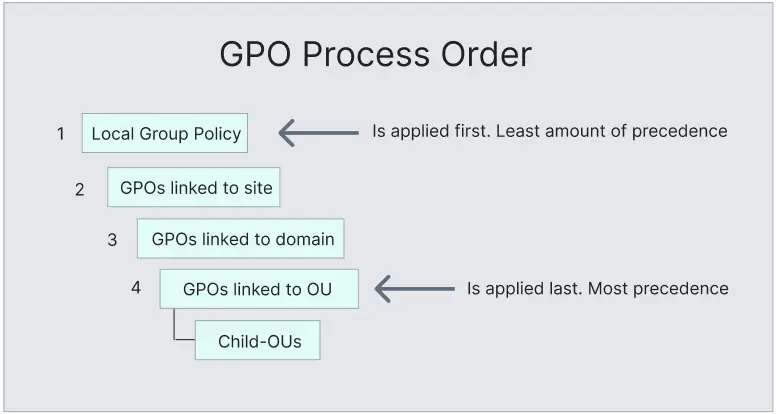

 ### Examining Group Policy

 A feature in Windows used to manage settings for user and computer accounts.  Every Windows machine has a Local Group Policy Editor, but we mainly focus on domain-based Group Policy in Active Directory.  It helps configure user settings, operating systems, and applications across many machines, especially useful for security management. Crucial for improving overall security (defense-in-depth strategy). Active Directory isn't secure by default; Group Policy helps fix that.

### Group Policy Objects (GPOs)

 A Group Policy Object (GPO) is a set of policy settings that control user and computer configurations in a Windows environment. 

- Enforce security policies (e.g., password rules, screen lock timeouts).
- Manage hardware (e.g., disable USB ports).
- Control software (e.g., install/uninstall programs, manage applications).
- Customize network and remote access settings.

### Order of Precedence

| **Level** | **Description** |
| --- | --- |
| **Local Group Policy** | Policies set directly on a local machine. These are the lowest in priority and get overridden by any matching settings from higher levels. |
| **Site Policy** | Policies applied to a specific site (e.g., a building or location). Useful for site-specific settings like access control or printer mapping. |
| **Domain-wide Policy** | Policies that apply to all users and computers across the entire domain, such as password complexity or a login screen banner. |
| **Organizational Unit (OU)** | Policies that apply to specific groups of users or computers based on their OU. Useful for role-based settings like HR or IT-specific configurations. |
| **Nested OU Policies** | Policies for sub-groups within an OU. Used to apply more refined or specific settings, like special AppLocker rules for Security Analysts. |

Group Policy can be managed using the Group Policy Management Console on a domain controller, through custom applications, or with PowerShell commands using the GroupPolicy module.

The Default Domain Policy is automatically created and linked to the domain with the highest priority, and it's best used for settings that apply across all users and computers in the domain. 

The Default Domain Controllers Policy is also created by default and applies to all domain controllers, setting basic security and audit configurations that can be customized as needed.

### GPO Order of Precedence

GPOs are processed from top to bottom in Active Directory. Domain-level GPOs are processed first, followed by those linked to child OUs. GPOs linked directly to an OU have the highest priority and can override higher-level settings. Additionally, computer settings always override user settings for the same configuration.

### GPO Precedence Order

### GPMC Hive Example

In the Group Policy Management Console (GPMC), GPOs are processed based on their Link Order. The GPO with the lowest Link Order (Link Order 1) is processed first and has the highest precedence, followed by the others in ascending order. For example, in the case of multiple GPOs linked to the Corp OU, the Disallow LM Hash GPO (Link Order 1) takes precedence over the Block Removable Media and Disable Guest Account GPOs.

Additionally, you can set the Enforced option on a GPO to ensure its settings cannot be overridden by GPOs linked to lower-level OUs. If a GPO is enforced at the domain level, its settings will apply to all OUs in the domain and cannot be changed by GPOs at the OU level. This was previously called No Override. For example, the Logon Banner GPO can be enforced to ensure its settings take precedence and aren't overridden by lower OU policies.

### Default Domain Policy Override

The Block Inheritance option prevents higher-level GPOs from applying to an OU. However, if a GPO is set to Enforced (No Override), it takes precedence over Block Inheritance and will still apply. For example, if the Computers OU has Block Inheritance enabled, it won’t inherit GPOs from the Corp OU unless those GPOs are enforced.

### Group Policy Refresh Frequency

By default, Group Policy updates occur every 90 minutes with a randomized offset of +/- 30 minutes for users and computers, while domain controllers update every 5 minutes. This means it can take up to 2 hours for a new GPO to take effect. The random offset helps avoid overwhelming domain controllers with simultaneous requests.

We can change the default refresh interval by going to Computer Configuration > Policies > Administrative Templates > System > Group Policy and adjusting the Set Group Policy refresh interval for computers setting. To force an immediate update, use the gpupdate /force command, which checks for GPO changes and applies them. However, setting the refresh interval too frequently can cause network congestion and replication issues.

### Security Considerations of GPOs

GPOs can be exploited for attacks, such as adding extra rights to user accounts, creating local administrators, or running malicious tasks like installing malware or establishing reverse shell connections. These attacks typically occur when a user has the rights to modify a GPO that affects an OU containing a user account or computer under the attacker's control.

For example, using tools like BloodHound, an attacker might find that a group, such as Domain Users, can modify a GPO like the Disconnect Idle RDP GPO due to nested group memberships. The next step would be to check which OUs the GPO applies to and determine if it can be used to target high-value users (like admins or domain controllers) or critical machines, allowing the attacker to escalate privileges and move laterally within the domain.
