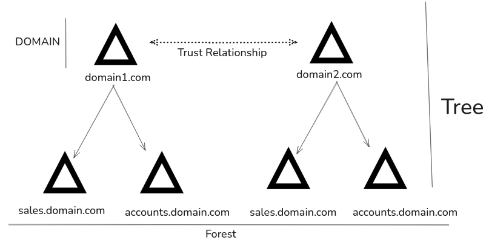

Active Directory (AD) is a directory service developed by Microsoft for Windows network environments.

It uses a distributed and hierarchical structure to centrally manage an organization’s resources.

Resources managed include users, computers, groups, network devices, file shares, group policies, servers, workstations, and trusts.

AD provides both authentication (identity verification) and authorization (access control) within a Windows domain.

Active Directory Domain Services (AD DS) is a core component that stores directory data like usernames, passwords, and access rights.

AD DS makes this data available to standard users and administrators across the network.

First shipped with Windows Server 2000, AD has become an essential part of enterprise network management.

AD was designed to be backward-compatible, but many features are not secure by default.

Managing AD in large environments can be challenging, and it is often misconfigured.

Due to its widespread use and potential weaknesses, AD has become a frequent target for cyberattacks.

- Active Directory is structured in a hierarchical tree format, with a **forest** at the top. A **forest** acts as the security boundary and can contain one or more **domains**. A **domain** is a logical grouping of network objects like users, computers, and groups.
- Domains can have **child** or **subdomains**, forming a tree-like structure. Within each domain, there are **Organizational Units (OUs)** used to organize objects. OUs can contain users, computers, groups, or even other sub-OUs.
- **Group Policies** can be applied at the OU level to manage user and computer settings. This structure helps administrators manage and secure resources efficiently across the network.

**Active Directory Structure** 

```bash
INLANEFREIGHT.LOCAL/
├── ADMIN.INLANEFREIGHT.LOCAL
│   ├── GPOs
│   └── OU
│       └── EMPLOYEES
│           ├── COMPUTERS
│           │   └── FILE01
│           ├── GROUPS
│           │   └── HQ Staff
│           └── USERS
│               └── barbara.jones
├── CORP.INLANEFREIGHT.LOCAL
└── DEV.INLANEFREIGHT.LOCAL
```

Here root domain is INLANEFREIGHT.LOCAL

**Subdomain**

- **ADMIN.INLANEFREIGHT.LOCAL**
- **CORP.INLANEFREIGHT.LOCAL**
- **DEV.INLANEFREIGHT.LOCAL**

The subdomain can be child domain or tree root domain depending on how it is configured. Within domain we can see AD object like users, group and computers.

Active Directory Forest Structure



In the above diagram we have two separates forests, these forest are connected via bidirectional trust. This allows to access of each others resources. Each forest can have multiple child domain.
