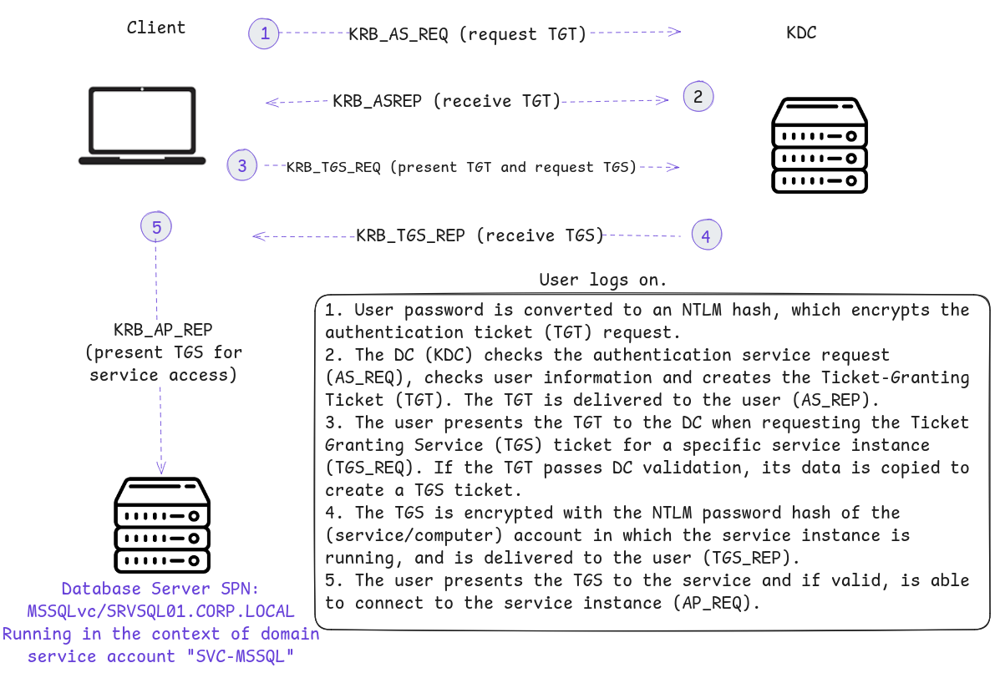
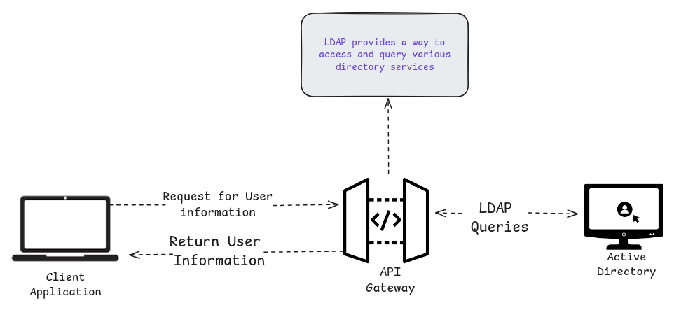

Windows use variety of protocol for communication. So Active Directory requires:

- LDAP  to access and manage directory data
- Kerberos to handle secure authentication
- DNS is crucial for locating domain controllers and services.
- MSRPC facilitates client-server communication for Active Directory tasks

### Kerberos

Kerberos is the default authentication protocol for domain accounts, ensuring secure authentication without transmitting passwords over the network.

**How it works:**

1. **Login Request**: The user requests a ticket from the Kerberos Key Distribution Center (KDC) on the Domain Controller, encrypting the request with their password.
2. **Ticket Granting Ticket (TGT)**: If the KDC decrypts the request successfully, it issues a TGT to the user.
3. **Ticket Granting Service (TGS) Request**: The user presents the TGT to request access to a specific service, which is encrypted with the service's NTLM password hash.
4. **Accessing the Service**: The client then uses the TGS to access the service, and if the process is correct, the user gains access.

Kerberos ensures security by using tickets instead of passwords, and the KDC only verifies identity, not storing previous transactions.



### DNS

It is important for locating Domain Controllers and enabling communication between systems. It resolve hostnames to IP addresses using SRV(service) records, which helps client to find service like printer

- It use UDP port 53
- without accurate DNS record client cannot find services

### Forward DNS Lookup

It is used to find the IP address of domain 

```bash
nslookup INLANEFREIGHT.LOCAL
# Returns IP address of Domain Controllers
```

### Reverse DNS Lookup

Used to find the hostname from an IP address.

```bash
nslookup 172.16.6.5
# Returns hostname ACADEMY-EA-DC01.INLANEFREIGHT.LOCAL
```

### Finding IP Address of a Host

we can find a host’s IP directly by querying its name.

```bash
nslookup ACADEMY-EA-DC01
# Returns IP address 172.16.6.5
```

### LDAP

its a protocol used to query and authenticate against directory services like Active Directory (AD).

- use port 389 for LDAP and port 636 for secure LDAP (LDAPS). which allows systems and applications to "talk" to AD to get user details, passwords, etc.
- Some environments may use OpenLDAP instead of Active Directory.



### AD LDAP Authentication

LDAP authenticates users in active directory using the process called BIND

There are two type of LDAP of authentication 

1. Simple Authentication: uses username/password directly (can be anonymous or basic login).
2. SASL Authentication(Simple Authentication and Security Layer): uses other services like Kerberos to handle login securely.

LDAP authentication is message are sent in cleartext. it is recommended to use TLS

### MSRPC

It is used in Windows for communication between services and clients in an AD domain.

Used to access system in AD using four key RPC interfaces. 

| Interface | Description |
| --- | --- |
| **lsarpc** | Manages domain security policies via the Local Security Authority (LSA). |
| **netlogon** | Authenticates users/services in the background within a domain. |
| **samr** | Manages users/groups (SAM database); often used by attackers for recon with tools like BloodHound. |
| **drsuapi** | Handles replication between Domain Controllers; can be abused to extract the NTDS.dit database (user hashes). |
