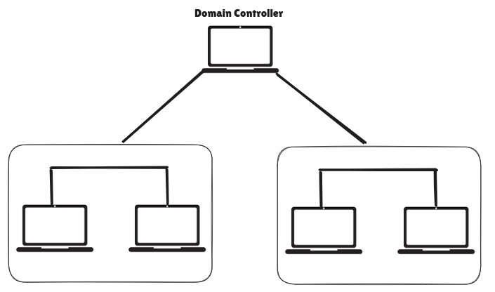

Central Domain is a server responsible for managing network, it acts as a gate keeper authenticates whether the user is allowed to access the domain resources or not. 

This approach is useful in business with multiple user and spread across multiple location. The main idea of domain is to make it easier to manage user, computer and other resources in windows network from one place. This is done by using **Active Directory.** It is manages by domain controller.

Assuming the there are above 100 computers located in different location, so to take control to these computer by administration we have to use Window Domain concept. Where all the computer are under one computer. 

In a Windows domain, credentials are stored in a centralized repository called Active Directory.

The server in charge of running the Active Directory services is called Domain Controller

Active Directory is important part of a Window Domain. It works as a central database that keeps everything in the network, like user account, security settings and group policies. Since it contain all the information in one place it is easy to manage and organize the network. AD knows who is trying to access the network and who all are authorized to access the network making it more secure and easier to maintain.

- any domain user with no special privilege can view the AD structure which allows attacker to gather more information and look for vulnerabilities.
- standard user account can be used to perform various attacks like lateral and vertical movement within the network if AD is not secured properly.

Around 95% of Fortune 500 companies use Active Directory, making main target for attacker. Attacker with standard user access is enough to map out domain and advance the attack. 

Ransomware gangs, like Conti, have used AD as a key part of their attack chain. Attacks like PrintNightmare (CVE-2021-34527) and Zerologon (CVE-2020-1472) show how privilege escalation and lateral movement can happen through AD. These exploits often only require standard user access to eventually gain full domain admin control.

### History of Active Directory

- **LDAP** (Lightweight Directory Access Protocol) — the core of AD — was introduced in RFCs around **1971**.
- **X.500 standard** and **Novell Directory Services** (1993) were early directory systems that influenced AD.
- Microsoft’s early directory service attempt: **Windows NT 3.0** (1990), combining LAN Manager and OS/2.

**Evolution of Active Directory** 

- **Mid-90s**: Microsoft started working on AD.
- **1997**: First beta release of Active Directory.
- **2000**: AD officially released with **Windows Server 2000**.
- **2003**: Added **Forests** – containers for domains, users, computers under one structure.
- **2008**: Introduced **ADFS (Active Directory Federation Services)** for **Single Sign-On (SSO)** across organizations using identity claims.
- **2016**:
    - Introduced **Group Managed Service Accounts (gMSA)** – helps secure automated tasks and mitigate **Kerberoasting**.
    - Focus shifted towards the **cloud** with **Azure AD Connect** for Office 365.

- AD has been vulnerable to mistakes in setup (misconfigurations) and cyberattacks since the year 2000.
- Other tools like Microsoft Exchange can also create security problems that affect AD.
- Dangerous attacks such as PrintNightmare, Zerologon, and Kerberoasting show how serious these issues can be.
- That’s why it's important for companies to regularly update (patch) and keep an eye on (monitor) their AD systems.

Why should we learn AD???

- About 95% of Fortune 500 companies still use Active Directory.
- Even though many are moving to the cloud, most companies still depend on on-premises AD.
- So, if we work in cybersecurity, we’ll almost always deal with AD, whether you’re attacking or defending.