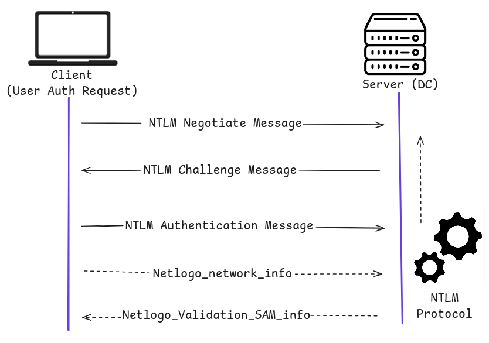

LM (LAN Manager) and NTLM (NT LAN Manager) are just hash formats.

NTLMv1 and NTLMv2 are authentication protocols that use LM or NT hashes. Kerberos is preferred due to stronger security and mutual authentication. LM/NTLM/NTLMv1 are outdated and insecure, still exploited in legacy environments. NTLMv2 is more secure but still weaker than Kerberos.

So kerberos is mostly recommended.

### Hash Protocol Comparison

| **Hash/Protocol** | **Cryptographic Technique** | **Mutual Authentication** | **Message Type** | **Trusted Third Party** |
| --- | --- | --- | --- | --- |
| **NTLM** | Symmetric key cryptography | No | Random number | Domain Controller |
| **NTLMv1** | Symmetric key cryptography | No | MD4 hash, random number | Domain Controller |
| **NTLMv2** | Symmetric key cryptography | No | MD4 hash, random number | Domain Controller |
| **Kerberos** | Symmetric & asymmetric cryptography (e.g., DES, MD5) | Yes | Encrypted ticket | Domain Controller / KDC |

**Note:** Kerberos provide stronger security through mutual authentication and ticket based access. It is recommended choice in modern AD.

### LM (LAN Manager)

| **Attribute** | **Details** |
| --- | --- |
| **Introduced** | 1987 (on OS/2) |
| **Storage Location** | `SAM` database (local) <br> - `NTDS.DIT` (Domain Controller) |
| **Max Password Length** | 14 characters |
| **Case Sensitivity** | No Passwords are converted to **uppercase** before hashing |
| **Password Split** | Split into **two 7-character chunks** |
| **Padding** | If <14 chars, padded with NULLs |
| **Encryption Method** | - Each chunk used to generate a DES key <br> - Encrypted against `KGS!@#$%` |
| **Output Format** | Two 8-byte DES-encrypted values, concatenated |
| **Hash Appearance** | Looks like: `299bd128c1101fd6` |
| **Security Weakness** | - Easily brute-forced <br> - Limited keyspace (69 chars) |
| **Cracking Tools** | Easily cracked using **Hashcat**, especially with GPUs |
| **Modern OS Default** | Disabled by default since **Windows Vista / Server 2008** |
| **Disabling via Policy** | Can be enforced through **Group Policy** |

Password are split and hashed separately, so an attacker only need to brute force 7 characters at a time. If password is less than 7 character, the second hash half is predictable. If password have limited character its easy to crack through brute force attacks.

### NTHash (NTLM)

It is used in modern windows systems.

- First password is encoded in UTF-16 little-endian, then hashed using MD4 algorithm, but it is outdated and considered weak.
- Hashes are stored in SAM (Security Account Manager) database
- Domain Controller: In the NTDS.DIT Active Directory database.

If hashes are exposed, it is easily crackable using the tool like hashcat and other. No salt is added.



NTLM Authentication Request

**Why NTLM hashes are still a problem though it is stronger than LM**

| **Concern** | **Details** |
| --- | --- |
| **No Salt** | NTLM hashes do **not use salting**, meaning identical passwords will produce identical hashes. This enables precomputed attacks like **rainbow tables**. |
| **Fast Hashing** | MD4, the algorithm behind NTLM, is **very fast**, which is good for computers but **bad for security** — attackers can brute-force them quickly using GPU tools like **Hashcat**. |
| **Offline Brute Force** | Entire 8-character NTLM keyspace can be cracked in **under 3 hours** using modern GPUs. Even longer passwords can be cracked via **dictionary + rule-based attacks**. |
| **Vulnerable to Pass-the-Hash (PtH)** | With **no need for the actual password**, an attacker can use just the NTLM hash to authenticate on systems where the user is a **local admin**. |
| **LM Hash Storage** | Systems still storing LM hashes (even if unused) present an extra risk. LM hashes are trivially crackable due to their split-hash nature and fixed case/length rules. |
| **Legacy Protocols Still Active** | Many environments, especially in large or older enterprises, still have **NTLM or NTLMv1 enabled**, making them easy targets if proper hardening isn’t done. |

```bash
Rachel:500:aad3c435b514a4eeaad3b935b51304fe:e46b9e548fa0d122de7f59fb6d48eaa2:::
```

| **Field** | **Meaning** |
| --- | --- |
| `Rachel` | Username |
| `500` | RID (Relative Identifier) — 500 = **Administrator** |
| `aad3c435...` | LM hash (useless if LM is disabled) |
| `e46b9e54...` | NT hash (MD4 of UTF-16 password) |

Tools like CrackMapExec or Impackets can use just the NT hash for authentication.

```bash
crackmapexec smb 10.129.41.19 -u rachel -H e46b9e548fa0d122de7f59fb6d48eaa2
```

### NTLMv1 (Net-NTLMv1)

| **Issue** | **Explanation** |
| --- | --- |
| **Weak Cryptographic Foundation** | Uses **DES** (Data Encryption Standard), which is outdated and easily brute-forced with modern hardware. |
| **Relies on LM/NT Hash** | Incorporates **LM hashes**, which are extremely insecure. Even if LM is disabled, it still uses **unsalted NT hashes**, allowing precomputed/rainbow table attacks. |
| **No Salting** | Same challenge with the same password produces the same hash response. Makes it easy to build large rainbow tables or leverage known password/hash pairs. |
| **Vulnerable to Offline Cracking** | After capturing Net-NTLMv1 challenge/response (e.g., via tools like **Responder** or **Inveigh**), attackers can **crack the hash offline** very quickly. |
| **Cannot Be Used for Pass-the-Hash** | Net-NTLMv1 hashes **cannot be used directly** to authenticate via PtH attacks — instead, they must be cracked to retrieve the original password. Still dangerous, but less flexible for attackers than NTLMv2. |
| **Legacy Support Only** | It exists only for compatibility with **older systems** and should be **explicitly disabled** on modern networks. |

### Domain Cached Credentials (MSCache2)

| **Feature** | **Description** |
| --- | --- |
| **Purpose** | Allows domain-joined machines to authenticate locally when the Domain Controller is unreachable. |
| **How It Works** | Saves the last 10 user hashes in the registry key `HKEY_LOCAL_MACHINE\SECURITY\Cache` after a successful login. |
| **Hash Format** | Stored in the format: `$DCC2$10240#username#<hash>` (e.g., `$DCC2$10240#bjones#e4e938d12fe5974dc42a90120bd9c90f`). |
| **Cracking Difficulty** | Hashes are difficult to crack with tools like Hashcat, even with powerful GPUs, requiring **targeted** efforts or weak passwords. |
| **Pass-the-Hash Limitations** | DCC2 hashes cannot be directly used in Pass-the-Hash (PtH) attacks. Only **cracking** the hash retrieves the plaintext password. |
- MSCache2/DCC2 allows offline authentication by caching the last 10 domain user hashes locally.
- These hashes are difficult to crack and cannot be used directly in PtH attacks.
- Requires local admin access to retrieve the cached hashes.
- Offline cracking is resource-intensive, making it impractical unless weak passwords are used.
- Penetration testers must consider whether cracking DCC2 hashes is a viable strategy, depending on the password strength.
