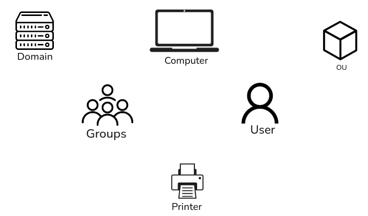

Any resources present within Active Directory such as user, computers, etc…

AD Objects

### Users

User are considered as leaf object, which means they cannot contain any other object within them

- Mailbox in Microsoft Exchange
- User has security Identifier(SID) and a Global Unique Identifier (GUID)
- User have many attributes like display name, last login time, password change date, email address, manager name and address.
- In total there can be more than 800 attributes for a user, but in most container only few are filled. which shows how big active directory is.
- Attacker focus on user because it can give access to many resources, even a standard user can help attacker to explore the domain.

### Contacts

It is used to represent external user 

- It stores information like first name, last name, email address and telephone number.
- Contact are leaf object
- It does not have SID
- Example of contact are vendor and customer.

### Printers

**Printer object** points to a printer that can be used in the AD network.

- It is a leaf object
- It does not have SID
- Printer objects have attributes like **printer name**, **driver information** and **port number**.

### Computers

Any computer in AD network

- It is leaf object
- It has both SID and GUID
- Just like user, computer are important target for attacker.
- If attacker get full control over computer, they can do almost everything a normal domain user can, only few task are blocked.

### Shared Folder

It  points to a **shared folder** on the computer where it is stored.

- It can have strict access control or it can be open to people without AD account.  restricted to authenticated users (like low-privileged user accounts or computer accounts like NT AUTHORITY\SYSTEM).
- It can be managed who can access the resources and who cannot.
- It does not have SID
- Attributes includes name, location on the system and security access rights.

### Groups

It is container object as it can hold users, computers and even other groups.

- It has both SID and GUID
- It is used to manage user permissions and access to resources.
- Instead of adding user one by one we can add them to a group, it can give permission
- group inside group is called Nested groups
- Some times nested group can give unintended rights to user.

### Organizational Units (OUs)

It is a container used by system administrators to store similar objects. It helps in managing and organizing objects.

- It is used to control tasks without giving full administrative rights
- If a user is given the right to reset passwords on the top-level OU, they can reset passwords for all users inside it.
- If departments have their own child OUs, the rights can be delegated more specifically.
- OUs are very useful for managing Group Policies for certain users or groups.
- For example, we can set a special password policy for privileged accounts by putting them in a specific OU and applying a Group Policy Object.
- Some attributes of an OU include its name, members, security settings, and more.

### Domain

It is a structure of Active Directory network

- it contain objects like users and computers. These objects are organized into container objects like groups and OUs. Every domain has its own separate database.
- Each domain has policies that can be applied to the objects inside it.
- Some default policies are already set, like the domain password policy.
- Organizations can also create their own custom policies.

For example, a policy can block access to cmd.exe for non-admin users.

Another example is mapping shared drives when users log in.

### Domain Controllers

It is a brain of the Active directory

- They handle authentication requests and verify users on the network and control who can access different resources in the domain. all access requests are validated through the Domain Controller.
- Privileged access is based on roles assigned to users.
- The Domain Controller also enforces security policies.

It stores information about every object in the domain.

### Sites

It is a set of computer connected over one or more subnets. These computer are connected using high-speed links

- It is used to make replication between domain controllers more efficient.

### Built-in

It is a container

- It holds default groups in an AD domain. These groups are predefined when the AD domain is created.

### Foreign Security Principals

It is an object created in Active Directory (AD).

- It represents a security principal from a trusted external forest.
- FSPs are created when a user, group, or computer from an external forest is added to a group in the current domain. They are created automatically when adding the external security principal. An FSP is a placeholder that holds the SID (Security Identifier) of the foreign object.
- Windows uses the SID to resolve the object's name through the trust relationship.
- FSPs are stored in a special container called ForeignSecurityPrincipals.

The distinguished name looks like this: cn=ForeignSecurityPrincipals,dc=inlanefreight,dc=local.