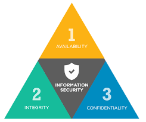

Active Directory (AD) is designed for centralized management of users and resources, enabling quick information sharing across a large userbase. By default, AD lacks many hardening measures, leaving it vulnerable if not properly configured. It is designed for ease of use and accessibility, which can sometimes compromise security.

Maintain an accurate list of all assets, including servers, computers, and devices within the AD environment to track and monitor potential vulnerabilities. Ensure that all systems, applications, and AD components are regularly updated with the latest security patches to fix vulnerabilities. Implement strict configuration management to ensure AD settings are standardized and secure, preventing unauthorized changes. Use antivirus and endpoint protection tools to safeguard devices that connect to the domain, preventing malware and unauthorized access.

To enhance Active Directory (AD) security, it's crucial to use Microsoft's built-in features that can be configured to protect against common attacks. Alongside these, other security measures like asset inventory, regular vulnerability patches, configuration management, endpoint protection, security awareness training, and network segmentation are essential for a comprehensive defense-in-depth strategy. The following hardening practices form the bare minimum to secure AD, and we will explore more advanced AD defense techniques in future modules.

### General Active Directory Hardening Measures

LAPS randomizes and rotates local administrator passwords on Windows hosts to prevent lateral movement and enhance security.

### LDAP

LAPS allows you to automatically rotate local administrator passwords at set intervals (like every 12 or 24 hours). It's a helpful tool to reduce the impact of a compromised host, but it should be used alongside other security practices for best results.

### Audit Policy Settings (Logging and Monitoring)

Audit Policy Settings help organizations track activities in Active Directory to detect potential attacks. By setting up proper logging and monitoring, you can identify suspicious actions like unauthorized user additions, changes to AD objects, password modifications, or advanced attacks like Kerberos exploitation. Effective monitoring is crucial for detecting and responding to security incidents quickly.

### Group Policy Security Settings

- Account Policies: Manage user accounts (password policies, lockout settings, Kerberos ticket lifetimes).
- Local Policies: Apply security settings to specific computers (user rights, event audits, restrictions on installing drivers, and controlling access to removable media).
- Software Restriction Policies: Control which software can run on a host.
- Application Control Policies: Restrict access to certain applications for users/groups (e.g., blocking CMD or PowerShell).
- Advanced Audit Policy Configuration: Audit activities like file access, logon/logoff events, and privilege usage.

### Update Management (SCCM/WSUS)

Proper patch management is crucial for securing Windows and Active Directory systems. **Windows Server Update Service (WSUS)** helps automate patching by being installed on a server, reducing manual patch management. **System Center Configuration Manager (SCCM)** builds on WSUS, offering additional features and greater control over patch deployment. These tools ensure timely and comprehensive patching, minimizing vulnerabilities in systems. Relying on manual patching can be slow and lead to missed patches, exposing systems to risks.

### Group Managed Service Accounts (gMSA)

**Group Managed Service Accounts (gMSA)** are domain-managed accounts designed for non-interactive applications, services, and tasks that require credentials to run. They offer higher security than traditional service accounts by automatically managing passwords, which are 120 characters long and generated by the domain controller. The password is regularly rotated and never needs to be known by users. gMSAs can be used across multiple hosts, providing secure credential management for automated processes.

### Security Groups

**Security Groups** in Active Directory simplify the process of managing access to network resources by grouping users together and assigning permissions to the group rather than individual users. This allows for more efficient management of rights and access within the AD environment. Common default security groups like Account Operators, Administrators, and Domain Admins are automatically created during installation. Security groups also help assign permissions for resources like file shares, folders, printers, and documents, making it easier to manage access in bulk.

### **Account Separation**

- Administrators should use two separate accounts: one for day-to-day work (e.g., `sjones`) and another for administrative tasks (e.g., `sjones_adm`).
- This minimizes risks if an account is compromised and prevents lateral movement.

### **Password Complexity + MFA**

- Use long, complex passwords (ideally 12+ characters).
- Implement multi-factor authentication (MFA) for sensitive tasks (e.g., Remote Desktop Access).
- Enforce password filters to block common words and weak passwords (e.g., `password`, `Welcome1`).

### **Limiting Domain Admin Account Usage**

- Domain Admin accounts should only be used for Domain Controllers.
- Prevent usage on personal workstations or non-essential systems to limit attack surfaces.

### **Auditing Stale Users & Objects**

- Regularly audit and remove unused or stale accounts, especially privileged service accounts.
- Old accounts with weak passwords can be exploited for lateral movement or privilege escalation.

### **Auditing Permissions and Access**

- Perform regular audits to ensure users only have necessary access.
- Review memberships in high-privilege groups like Domain Admins and Enterprise Admins to limit attack surface.

### **Audit Policies & Logging**

- Implement robust logging to track user activity, such as failed logins or suspicious Kerberos requests.
- Use logging to detect attacks like password spraying, Kerberoasting, or enumeration attempts.

### **Using Restricted Groups**

- Use Group Policy to restrict group memberships, especially for highly privileged groups like Domain Admins and Enterprise Admins.
- Control local admin group memberships on all hosts to reduce privilege escalation risks.

### **Limiting Server Roles**

- Avoid installing unnecessary roles on sensitive servers (e.g., Domain Controllers).
- Separate web roles (e.g., IIS) and database roles to reduce the attack surface.

### **Limiting Local Admin and RDP Rights**

- Control who has local admin rights on machines using Restricted Groups.
- Limit Remote Desktop (RDP) access to reduce the risk of sensitive data exposure or privilege escalation.
