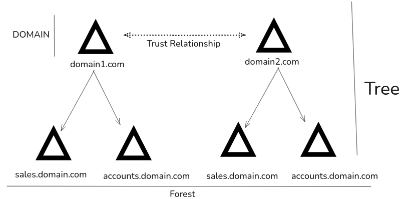

some key terminology that will be used throughout this module are:

### Objects

Any resources present in Active Directory like user, printer, domain controller, etc

### Attribute

Every object in AD has set of attributes used to define characteristics of given objects. A computer object in AD stores attributes like the hostname and DNS name, with each attribute having an LDAP name, such as `displayName` for Full Name and `givenName` for First Name.

### Schema

it is a buleprint of any enterprise environment. It defines what types of objects can be present in AD database. It describes different classes(e.g:  "user" class for user accounts). When object is created based on class it is called instantiation. The created object is called instance. 

### Domain

It is logical group of objects such as computers, users, etc. It can operate independently of one another or connected through trust relationships. 

### Forest

Its a collection of Active Directory domains. It may contain one or more domain, each forest     operates independently but may have various trust relationships with other forests.

### Tree

Its is a collection of Active Directory domains that begins at a single root domain.

- a forest is collection of AD trees.
- each domain in a tree shares a boundary with other domains.
- a parent-child relationship is formed when a domain is added under another domain in a tree
- Two trees in the same forest cannot share a name (namespace).
- All domains in a tree share a single Global Catalog that stores information about all objects within the tree.

### Container

A container in Active Directory is an object used to organize and group other objects like users, computers, and groups.

### Leaf

A leaf in Active Directory is an object that cannot contain other objects, such as a user or a computer.

### Global Unique Identifier (GUID)

A GUID is a unique 128-bit value assigned when a domain user or group is created. Just like MAC address.

- every single object is assigned a GUID
- GUID is stored in the ObjectGUID attribute.
- When we query for AD object, we can query for ObjectGUID using powershell
- Specifying the ObjectGUID during AD enumeration ensures the most accurate and precise results for the object being searched.
- ObjectGUID property never changes

### Security principals

A Security Principal in Active Directory is any object that can be assigned permissions to resources, such as users, groups, computers, or service accounts.

In Active Directory, security principals are domain objects that control access to resources across the domain, while local user accounts and local security groups manage access only on a specific computer and are handled by the Security Accounts Manager (SAM), not by AD.

### Security Identifier (SID)

it is used as unique identifier for security principal. 

- When a user logs in, an access token is created containing the user's SID, their rights and the SIDs of any groups they belong to, which the system uses to verify permissions for actions they attempt.

### Distinguished Name (DN)

it describes the full path to an object in AD(such as cn=bjones, ou=IT, ou=Employees, dc=inlanefreight, dc=local)

- bjones is the user's Common Name (CN) placed inside the IT department OU, under the Employees OU, within the domain inlanefreight.local.

### Relative Distinguished Name (RDN)

It is part of the Distinguished Name (DN) that uniquely identifies an object at its specific level in the directory hierarchy.

- even if two objects have the same RDN, they are treated as different if their full DNs are different.

### sAMAccountName

Its is the user's logon name.

### userPrincipalName

Its another way to identify users in AD.

- this attribute consist of prefix and suffix of domain name.

### FSMO Roles

In early days of AD, multiple Domain Controllers (DCs) could conflict when making changes, leading to inconsistencies. 

- Microsoft first used  a “last write wins” method, but it caused issues if the final change was incorrect.
- Then they introduced a master DC model, where only one DC make changes while other handled authentication, but it created a single point of failure.
- To fix this problem, Microsoft implemented **Flexible Single Master Operation (FSMO)** roles, splitting responsibilities among DCs to avoid service disruption.
- There are **five FSMO roles**: Schema Master and Domain Naming Master (one per forest), and RID Master, PDC Emulator, and Infrastructure Master (one per domain).
- All five roles are initially assigned to the first DC in the forest root and each new domain added gets its own RID Master, PDC Emulator, and Infrastructure Master.
- FSMO roles are crucial for smooth replication and the stability of critical Active Directory services.

### Global Catalog

domain controller that have copies of all objects in an Active Directory forest.

- standard domain only stores domain-specific data, GC allows users and application to find object across all the domain.
- it also support authentication by providing group membership information needed to create access token during login
- It helps to make the directory structure **transparent** across the forest, enabling searches using just one attribute of an object.

### Read-Only Domain Controller (RODC)

It has a read only-only copy of AD database

- password are not cached on the **RODC,** except for **RODC’s** password
- No changes are **pushed out** from the RODC's AD database

### Replication

It happens when updated AD objects are **synchronized** from one Domain Controller (DC) to another.

- when DC is added connection objects are automatically created.
- It ensures all DC are updated, creating backup in case one DC fails.

### Service Principal Name (SPN)

it uniquely identifies a service instance in Active Directory.

- used by Kerberos authentication to link a service instance with a logon account, allowing client applications to authenticate to the service without needing to know the actual account name.

### Group Policy Object (GPO)

are virtual collections of policy settings, each identified by a unique GUID.

- it can contain both local file setting and AD setting
- it can be applied to both user and computer

### Access Control List (ACL)

is the ordered collection of Access Control Entries (ACEs) that apply to an object.

### Access Control Entries (ACEs)

- Identifies a trustee (user, group, or logon session) and specifies allowed, denied, or audited access rights.
- Controls access to objects based on permissions set for each trustee.

### **Discretionary Access Control List (DACL)**

- A list of ACEs defining which security principals are granted or denied access to an object.
- Controls whether access is allowed or denied by checking ACEs sequentially.

### **System Access Control List (SACL)**

- A list that specifies which access attempts to an object are logged.
- Enables auditing of successful or failed access attempts by generating security event log entries.

### **Fully Qualified Domain Name (FQDN)**

- The complete domain name for a specific computer or host ([hostname].[domain].[TLD]).
- Locates hosts in a domain hierarchy without using IP addresses.

### **Tombstone**

- A deleted AD object retained for a set period with most attributes removed.
- Allows soft-deleted objects to exist temporarily for replication and recovery purposes.

### **AD Recycle Bin**

- A feature that preserves deleted AD objects with most attributes intact for easier restoration.
- Facilitates object recovery without needing backups or server reboots.

### **SYSVOL**

- A shared folder containing public domain files like GPOs, logon scripts, and policies.
- Replicates critical AD files to all Domain Controllers for consistent environment configuration.

### **AdminSDHolder**

- A container object managing ACLs for privileged AD accounts.
- Ensures correct permissions for protected groups by applying a standard security descriptor regularly.

### **dsHeuristics**

- An attribute used to set forest-wide AD behavior settings.
- Modifies features like excluding groups from AdminSDHolder protection.

### **adminCount**

- An attribute indicating if an account is protected by AdminSDHolder.
- Accounts with `adminCount = 1` receive stricter ACL protections.

**Active Directory Users and Computers (ADUC)**

- A GUI tool for managing users, groups, computers, and contacts in AD.
- Allows easy administrative changes to Active Directory objects.

### **ADSI Edit**

- A GUI tool for low-level management of AD objects and attributes.
- Provides deep access to edit, move, and delete any AD object attributes.

### **sIDHistory**

- An attribute storing previous SIDs assigned to an object.
- Allows migrated users to retain previous access permissions.

### **NTDS.DIT**

- The AD database file storing users, groups, memberships, and password hashes.
- Centralizes and secures Active Directory data critical for authentication.

### **MSBROWSE**

- An old Microsoft networking protocol for browsing shared network resources.
- Maintained a network-wide list of available shared files and printers (obsolete today).
