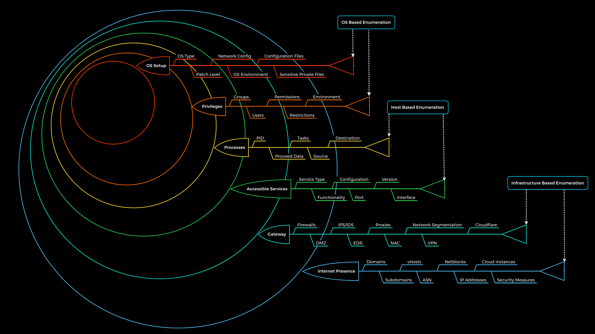
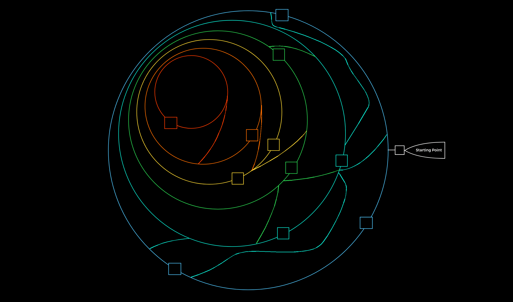

| **Layers** | **Description** | **Information Categories** |
| --- | --- | --- |
| 1. Internet Presence  | Identification of internet presence and externally accessible infrastructure. | Domains, Subdomains, vHosts, ASN, Netblocks, IP Addresses, Cloud Instances, Security Measures |
| 2. Gateway | Identify the possible security measures to protect the company's external and internal infrastructure. | Firewalls, DMZ, IPS/IDS, EDR, Proxies, NAC, Network Segmentation, VPN, Cloudflare |
| 3. Accessible Seivices | Identify accessible interfaces and services that are hosted externally or internally. | Service Type, Functionality, Configuration, Port, Version, Interface |
| 4. Processes | Identify the internal processes, sources, and destinations associated with the services. | PID, Processed Data, Tasks, Source, Destination |
| 5. Privileges | Identification of the internal permissions and privileges to the accessible services. | Groups, Users, Permissions, Restrictions, Environment |
| 6. OS setup | Identification of the internal components and systems setup. | OS Type, Patch Level, Network config, OS Environment, Configuration files, sensitive private files
 |

**Layer No.1: Internet Presence** 

- finding the target that we can investigate
- The goal of this layer is to identify all possible target systems and interfaces that can be tested.

**Layer No.2: Gateway**

- The goal is to understand what we are dealing with and what we have to watch out for.

**Layer No.3: Accessible Services**

- This layer aims to understand the reason and functionality of the target system and gain the necessary knowledge to communicate with it and exploit it for our purposes effectively.

**Layer No.4: Processes** 

- The goal here is to understand these factors and identify the dependencies between them.

**Layer No.5 Privileges** 

- It is crucial to identify these and understand what is and is not possible with these specific privileges.

**Layer No.6: OS Setup**

- This gives us a good overview of the internal security of the systems.
- Reflects the skills and capabilities of company’s administrative team.
- The goal here is to see how the administrators manage the systems and what sensitive internal information we can glean from them.