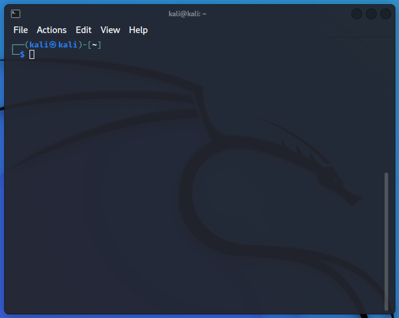

Being a Linux user it is crucial to learn how to use shell. To control the operating system effectively, it's important to understand and master the essential part of Linux Shell.

this is kali linux terminal.

A Linux terminal, also known as a shell or command line, is a text-based interface that lets users interact with the system by running commands to control it, like navigating directories, managing files and more—similar to a GUI but with greater capabilities.

## Terminal Emulators

Terminal Emulator is software that emulates the function of a terminal. A terminal allows you to use text-based programs within a graphical interface and can run multiple command-line interfaces (CLIs); in short, it acts as a bridge to the shell interpreter.

Imagine you're in a big office building—the shell is the main server room that processes all data and commands, while the terminal is like the receptionist's desk where you deliver instructions to the server room to get things done.

## Shell

The most commonly used shell in Linux is the Bourne-Again Shell (BASH), part of the GNU project. Everything possible in the GUI can also be done in the shell, which offers more control, faster access to information and easy automation through scripts.

Beside BASH shell, there also exist other shell like Ksh, Fish...

